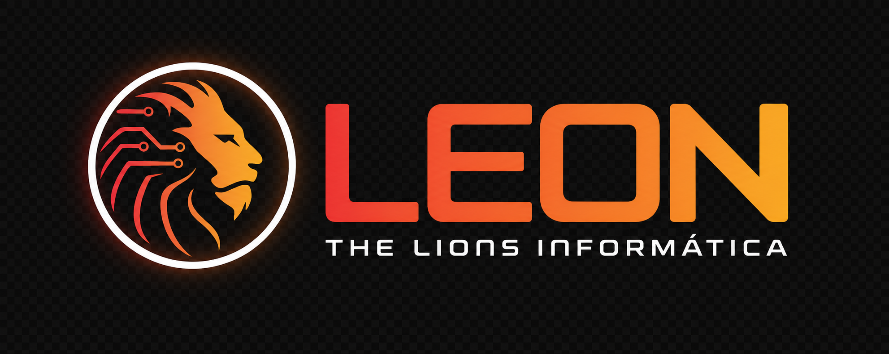

# Leon — The Lions Informática



English | [中文](README.zh.md)

Leon is The Lions Informática's local-first AI workspace, with Brazilian Portuguese enabled by default and a dedicated product identity. This repository is our maintained fork of [DeepSeek Harness](https://github.com/deepseek-ai/deepseek-harness), the open-source agent harness developed by [DeepSeek AI](https://deepseek.com).

It uses an architecture where **everything is a plugin**, and is powered by [Cordis](https://github.com/cordiverse/cordis), whose design is described in [_A Programming Paradigm for Spatiotemporal Composability_](https://github.com/cordiverse/paper).

## Developer preview

Leon and its DeepSeek Harness foundation are currently in _developer preview_ and are iterating rapidly. **THERE WILL BE COMPATIBILITY-BREAKING CHANGES.**

## Run

### Run from `npm`

Install `Node.js`, then run:

```sh
npx @deepseek-ai/dsh web
```

The command starts the Web UI at `http://127.0.0.1:3080` by default and opens it in the default browser for a local launch. An SSH launch only prints the host URL because the SSH client or editor owns the local forwarded address. Pass `--no-open` to run the server without opening a browser. See [Web UI guide](docs/user/guide/index.md).

### Run from source

To run from a repository checkout:

```sh
git clone https://github.com/Thelionsinformatica/deepseek-harness.git
cd deepseek-harness
pnpm install
pnpm run build
pnpm dsh web
```

`pnpm run build` prepares the repository artifacts. `pnpm dsh web` uses those built artifacts without rebuilding.

## Leon project and upstream community

- Submit Leon feedback and bug reports through the [The Lions Informática repository](https://github.com/Thelionsinformatica/deepseek-harness/issues).
- Upstream discussions remain available in the [DeepSeek Harness community](https://github.com/deepseek-ai/deepseek-harness/discussions).
- Add the [`dsh-plugin`](https://github.com/topics/dsh-plugin) topic to your plugin repository for discoverability.
- Join <a href="https://discord.gg/Ycq5dCaS4">DeepSeek Harness Discord community</a>.

## Contributing

See [CONTRIBUTING.md](CONTRIBUTING.md).

## Development

Start with the [development guide](docs/development.md) and [architecture documentation](docs/architecture.md).

For agents, follow [AGENTS.md](AGENTS.md).

## License

[MIT](LICENSE)

Third-party dependencies and their licenses are disclosed in [THIRD_PARTY_NOTICES.md](THIRD_PARTY_NOTICES.md).
